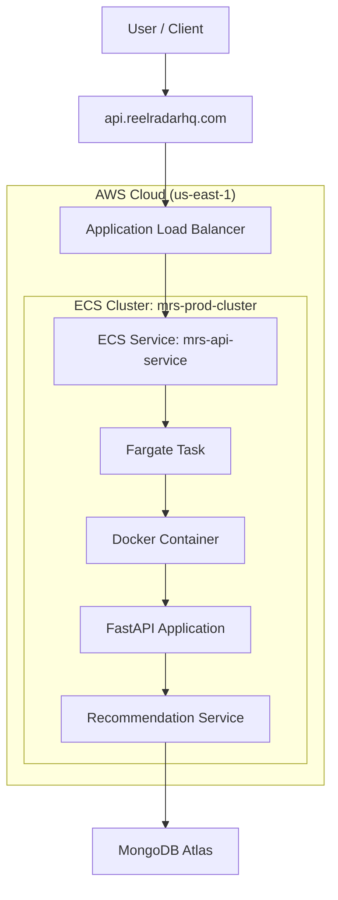

# Movie Recommender System

A production-oriented movie recommendation system designed with a clean, layered architecture and a strong focus on maintainability, testability, and real-world engineering practices.

---

## Status

🚧 **Work in Progress**

This project has undergone a **major architectural refactor** toward a Clean Architecture structure:

- Domain / Core (pure business logic, no I/O)
- Service layer (orchestration)
- API layer (delivery)

Older structures may still exist in the commit history.

---

## What’s Implemented So Far

- Pure Domain/Core recommendation logic (I/O-free)
- User-based and Item-based Collaborative Filtering
- Matrix Factorization (SVD-style) model
- Similarity computation (user-user, item-item)
- Ranking and recommendation orchestration
- Production-ready FastAPI delivery layer
- Offline evaluation with reproducible metrics
- Fully unit-tested core and integration-tested contracts

---

## Tech Stack

- Python
- Pandas / NumPy
- PyTorch (matrix factorization)
- FastAPI
- Pytest
- Docker
- AWS ECS (Fargate)
- AWS Application Load Balancer
- MongoDB Atlas

---

## Project Goals

- Demonstrate clean architecture principles in a real ML system
- Separate business logic from infrastructure concerns
- Build a recommender system that is **production-ready**, not tutorial-style
- Apply BigTech-level engineering practices (contracts, tests, evaluation)

---

## Roadmap

- [x] Complete Domain/Core refactor
- [x] Finalize Service layer
- [x] API layer (FastAPI)
- [x] Evaluation and metrics
- [x] Docker containerization
- [x] AWS production deployment
- [ ] Observability and monitoring
- [ ] Rate limiting
- [ ] Performance benchmarking

---

# Architecture Overview (DDD-Inspired)

This project follows a **Domain-Driven Design (DDD) inspired** architecture with a clear separation of concerns between layers.

### High-level Flow

API (`apps/api`) → Service (`src/recommender/service`) → Domain (`src/recommender/domain`)

Infrastructure and data modules provide inputs to the service layer.

---

## Layers

### Domain (`src/recommender/domain/`)

Contains pure recommendation and ranking logic.

Characteristics:

- All computations are performed in memory
- No I/O operations
- Fully deterministic and unit-testable

Restrictions:

- No database access
- No file reads or writes
- No logging
- No network calls

Example modules:

- `predict_cf.py`
- `ranking.py`
- `recommend_for_user.py`

---

### Service (`src/recommender/service/`)

The service layer orchestrates domain logic and coordinates dependencies.

Responsibilities:

- Prepare inputs for the domain layer
- Call domain algorithms
- Map domain outputs to structured response objects
- Maintain separation between domain and infrastructure

---

### API (`apps/api/`)

The API layer exposes the system through HTTP endpoints using FastAPI.

Responsibilities:

- Request validation
- Response serialization
- API contracts
- Error handling
- Request lifecycle observability

Important rule:

The API layer contains **no business logic**.

---

### Infrastructure / Data

Infrastructure components handle all external systems.

Examples:

- MongoDB Atlas
- CSV / JSON data sources
- Data loaders
- Persistence

Responsibilities:

- Data access
- External integrations
- Side effects

Infrastructure supplies data to the service layer but never to the domain directly.

---

### Scripts (`scripts/`)

This directory contains standalone utilities such as:

- evaluation runners
- data preparation tasks
- MongoDB connectivity tests

Scripts are intentionally placed outside `src/` to keep the main package import-safe.

---

## Key Design Principle

> The domain layer is independent of I/O.

All side effects such as databases, files, network calls, and logging live **outside the domain layer**.

---

# Evaluation (Offline)

This project includes a reproducible offline evaluation protocol for recommendation quality.

---

## Protocol (Leakage-safe)

Evaluation follows a **per-user holdout strategy**.

For each eligible user:

- test item = last interaction
- train set = remaining interactions

Users must have **at least two interactions** to participate in evaluation.

Candidate items are drawn from the global training universe excluding items already seen in the user's training history.

---

## Metrics

The evaluation framework computes:

- **Precision@K**
- **Recall@K**

These metrics allow comparison between recommendation algorithms and baselines.

---

## Baselines

Two baselines are implemented:

**Popularity baseline**

- Recommends globally most popular items.

**Random baseline**

- Random recommendation with deterministic seed.

These baselines allow performance comparison with the recommendation model.

---

## Run Evaluation

```bash
make eval
make eval_md
```

---

# Production Architecture

The system is deployed on AWS using a containerized architecture.



---

## Live API

Production endpoint:

```
https://api.reelradarhq.com
```

Swagger documentation:

```
https://api.reelradarhq.com/docs
```

Health endpoint:

```
https://api.reelradarhq.com/v1/health
```

Example request:

```
GET /v1/recommendations/1?limit=5
```

---

## Engineering Focus

This project emphasizes **production-grade engineering practices**, including:

- Clean architecture separation
- Deterministic domain logic
- API contracts
- Automated tests
- Offline evaluation protocols
- Containerized deployment
- Cloud-native infrastructure

The goal is to demonstrate how a machine learning system can be structured and deployed with real-world software engineering discipline.